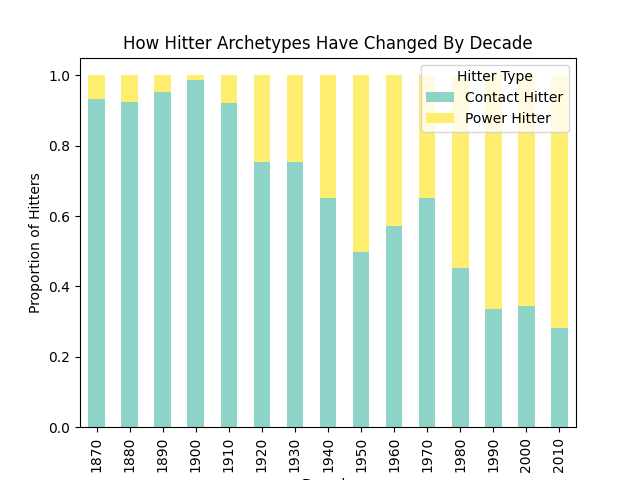

# MLB Clustering Project

This project uses clustering techniques in order to group MLB Hitters by power vs contact hitters. They are clustered based on a "power_contact_ratio" data feature and labeled accordingly. The visualization created shows the proportion of hitters by decade that fall under the "contact" vs "power" category.

## Visualization

## Data

The data used for this project was pulled from the "Baseball Databank" dataset on kaggle:
https://www.kaggle.com/datasets/open-source-sports/baseball-databank

## Purpose

This project serves the purpose of using clustering techniques to not only group players by hitting styles, but also compare how styles have changed throughout the decades.
